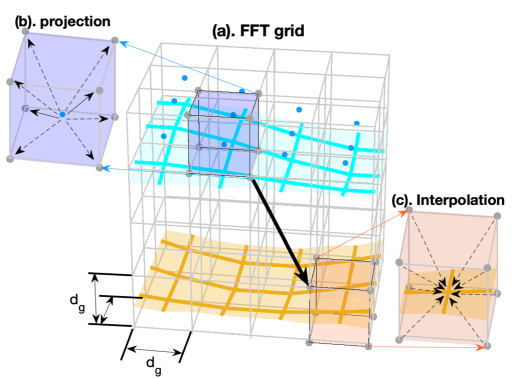
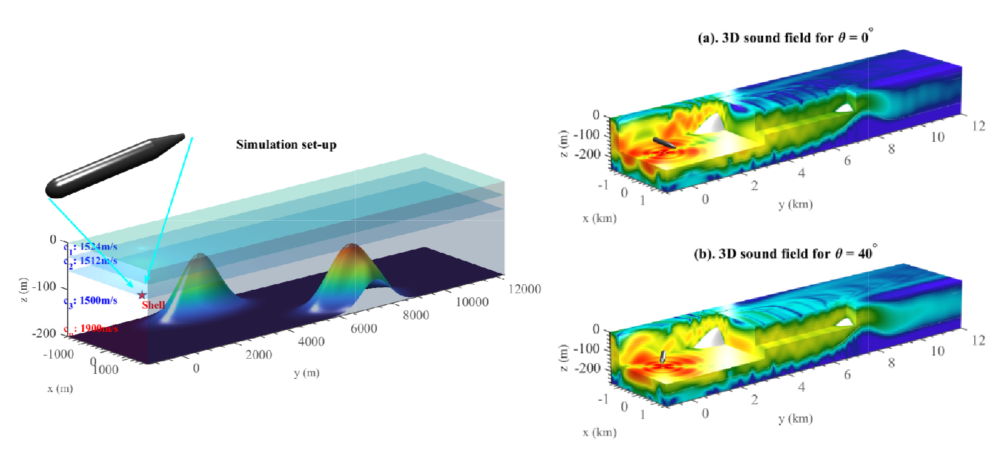
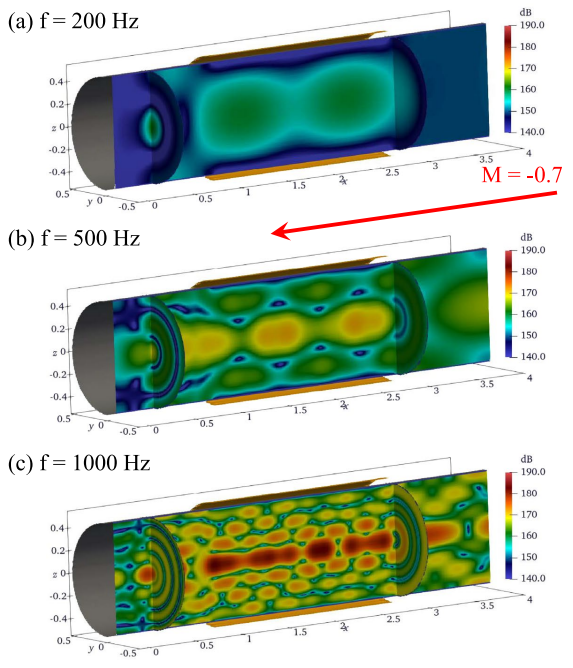
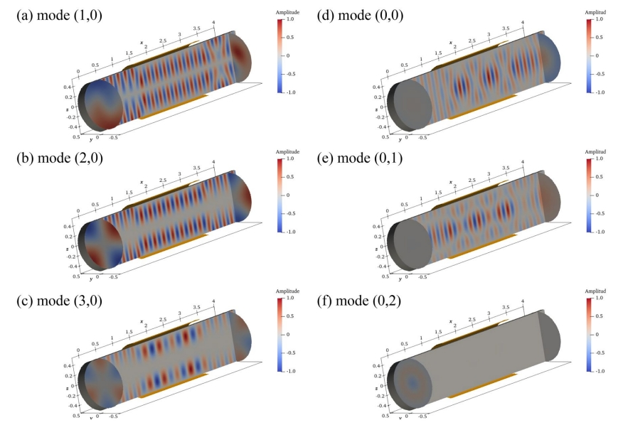
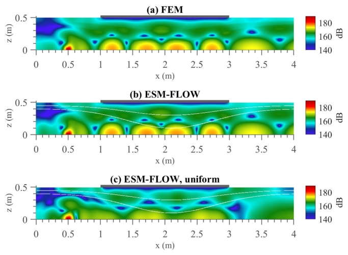

The Equivalent Source Method (ESM) finds extensive application in computational acoustics, especially in addressing complex boundary-value problems. Our objective is to develop numerical tools capable of addressing various engineering challenges, ranging from acoustic design in engines and ventilation systems to sound propagation in ice-covered oceans, utilizing the ESM. Specifically, we enhance the capabilities of ESM, a boundary integral-based method traditionally limited to homogeneous media, to address inhomogeneous media.

Large-scale 3D underwater acoustic propagation
======
3D full-wave simulations are essential for benchmarking underwater acoustic propagation with complex topographies. They are also useful for investigating 3D propagation effects, such as horizontal refraction and transverse coupling. Nevertheless, conducting 3D full-wave simulations using existing numerical approaches like FEM and BEM has been challenging due to limited computational resources. To address this challenge, we developed a powerful new numerical tool capable of handling the complex stratified ocean environment. In particular, computational efficiency is significantly enhanced by O(N1-2) compared with conventional numerical methods. For further details, please refer to [our recent work](https://pubs.aip.org/asa/jasa/article/150/4/2854/996056/Modeling-three-dimensional-underwater-acoustic).

By utilizing this approach, we can achieve large-scale 3D underwater acoustic propagation with high accuracy, using realistic bathymetry datasets. This method is particularly useful for benchmarking and exploring 3D propagation effects. It also proves highly effective for generating time-domain simulations, such as the time-domain propagation in a coastal wedge covered by a rough sea surface, as demonstrated below. For further details, please refer to [our recent work](https://pubs.aip.org/asa/jasa/article/148/1/73/965808/Three-dimensional-sound-scattering-from).
 

We have also extended the ESM-based model to simulate sound propagation in ice-covered oceans. The developed model accurately captures the propagation characteristics of both acoustic and elastic waves within an ice-water coupled system. A demonstration clip utilizing the model is provided below. For further details, please refer to [our recent work](https://pubs.aip.org/aip/pof/article/35/4/047126/2887218/Numerical-simulation-of-wave-propagation-in-ice).
 

In realistic ocean scenarios, source characteristics can be highly complex. We have developed a coupled model in which the finite element method (FEM) is employed to simulate intricate radiation patterns generated by various types of sources. This work represents the first attempt to integrate structural acoustic radiation with 3D underwater acoustic propagation, providing a valuable tool for evaluating sonar performance. For further details, please refer to [our recent work](https://www.sciencedirect.com/science/article/abs/pii/S0029801823002883?via%3Dihub)
 

Sound propagation in flow ducts
======
Theoretical modeling of sound propagation in lined ducts is essential for understanding waveguide physics. We have developed ESM-FLOW, a meshless, wave-based method for simulating sound propagation in 3D axisymmetric lined ducts. ESM-FLOW accurately captures the effects of airflow on sound propagation, making it highly applicable for acoustic design in engines and ventilation systems. The example below illustrates sound propagation within a flow duct with a uniform, high-speed flow (Mach 0.7) at varying frequencies. For further details, please refer to [our recent work](https://link.springer.com/article/10.1007/s00366-023-01905-9).

 

ESM-FLOW enables modal analysis, which is particularly useful for identifying critical spanning and transverse modes that dominate the sound field in high-speed flow environments.
 

Another key feature of ESM-FLOW is its capability to accommodate non-uniform flows in the solution, a challenge that most boundary-integral formulation (BIF) methods face. The example provided demonstrates the accuracy of ESM-FLOW through direct comparison with FEM results.
 

Animal acoustics mimicing dolphin detection
======

As the ESM can serve as an alternative to the Boundary Element Method (BEM), it can be extended to solve a wide range of boundary-value problems. Here, we apply the ESM to analyze scattering from a buried rigid sphere. For more details, refer to the demonstration clip below.
 
